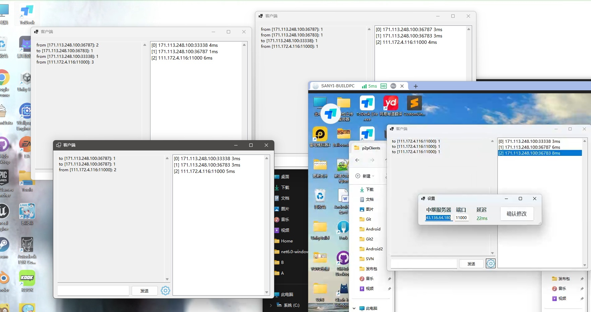
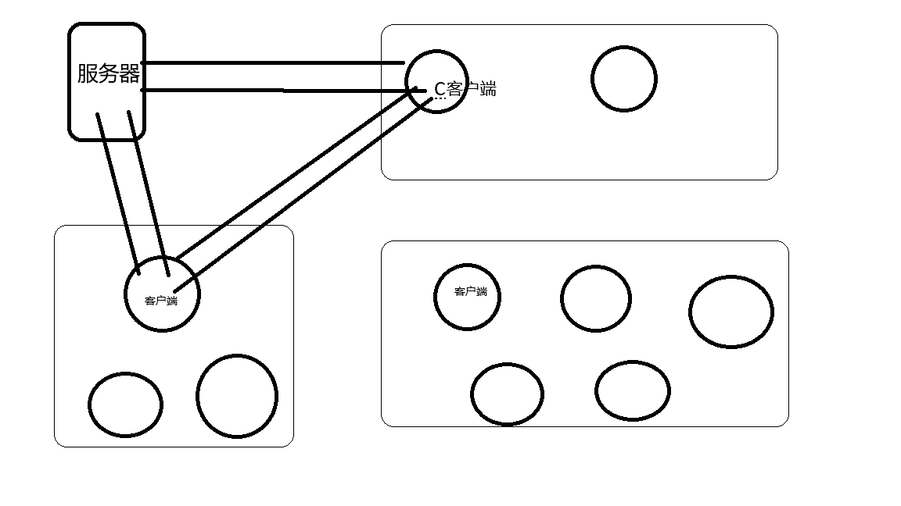

# p2p_udp
基于udp实现的多客户端p2p击穿NAT demo.  包含客户端( C# winform ), 服务端 ( C# dnet Core for linux )

# Socket
Udp

# 客户端
c# winform

# 服务端
linux x64系统

dnet core 7.0 sdk环境

# 程序运行截图

# 原理
## 后续补充

# 总结
1. 在不同局域网下 可以直接对NAT挖洞 可以看到p2p延迟是3ms 常规中继服务器的方式需要至少22ms
2. 可以有效降低云服务器负载 将算力搬到客户端

 

